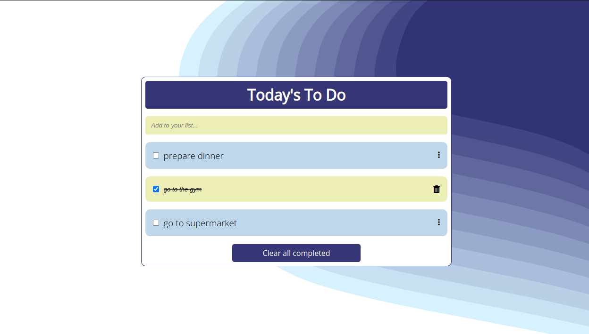

# To-Do List

>A simple to-do list to help you organize your daily tasks.

## Built With

- HTML.
- CSS.
- JavaScript: ES6, Modules, Classes, Arrow Functions, Events.
- Webpack.

## Live Demo

[Live Demo Link](https://williamscch.github.io/to-do-list/dist/)

## Quick view
> 

## Getting Started

To get a local copy up and running follow the next steps: -Copy the SSH key of the repository and make a 'git clone' in your terminal using the copied key, then you will be able to deploy this project locally.

## 👤 Author

- GitHub: [@wdavidcch](https://github.com/wdavidcch)
- Twitter: [@wdavidcch](https://twitter.com/wdavidcch)
- LinkedIn: [LinkedIn](https://www.linkedin.com/in/williams-colmenares-989a6b151)

## 🤝 Contributing

Contributions, issues, and feature requests are welcome!

Feel free to check the [issues page](../../issues/).

## Show your support

Give a ⭐️ if you like this project!

## Acknowledgments

- Microverse Module 2
- Project indications [here](https://github.com/microverseinc/curriculum-javascript/blob/main/todo-list/sneak_peek.md)

## 📝 License

This project is [MIT](./MIT.md) licensed.
